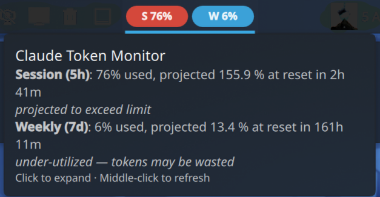

# Claude Usage Monitor — KDE Plasma 6 Widget

[Auf Deutsch lesen](README.de.md)



A subtle taskbar widget for **KDE Plasma 6** (tested on Plasma 6.6, Fedora 44)
that shows your Claude.ai Pro/Max **session** (5-hour) and **weekly** (7-day)
token utilization with a forecast for the next reset.

It reuses the OAuth token that Claude Code already stores in
`~/.claude/.credentials.json` and queries the same endpoint Claude Code's
`/usage` slash command uses — no scraping, no separate login.

> **Disclaimer.** This project is **not affiliated with, endorsed by, or
> sponsored by Anthropic**. "Claude" and "Claude.ai" are trademarks of
> Anthropic, PBC and are used here only nominatively to identify the service
> the widget interacts with. The widget relies on an undocumented endpoint
> that Anthropic can change or restrict at any time.

## What you see

Two small pills in the panel:

- `S 42%` — current 5-hour session utilization
- `W 79%` — current 7-day weekly utilization

Color (per pill, computed independently):

| Color   | Meaning                                                              |
|---------|----------------------------------------------------------------------|
| 🔵 Blue   | Projected to land below 95% — you'll likely leave tokens unused.     |
| 🟢 Green  | Projected 95–100% — sweet spot.                                      |
| 🟡 Yellow | Projected 100–103% — approaching the limit.                          |
| 🔴 Red    | Projected ≥103% — you'll run out before reset.                       |

The projection uses a rolling burn-rate from recent poll samples and is
bounded to a 4-hour horizon (so a single burst right after a window reset
doesn't extrapolate into the next week).

Hover for a tooltip with the full numbers; click to open a detail panel with
progress bars, burn rate, and time to reset. Middle-click forces an
immediate cache re-read.

## Install (from source)

```bash
git clone https://github.com/EnginKarahan/claude_usage_monitor.git
cd claude_usage_monitor
./install.sh
```

This:
- installs `~/.local/bin/claude-widget-poll` (the Python poller)
- installs and enables a systemd user timer that polls every 15 min
- installs the plasmoid via `kpackagetool6`

Then in KDE: right-click the panel → *Add or manage widgets…* → search for
**Claude Usage Monitor** and drag it where you want it.

## Install (KDE Store)

Once published, you can install via *Add or manage widgets…* → *Get new
widgets…* and search for "Claude Usage Monitor". The backend poller still
needs the one-time `./install.sh` for the systemd timer — the KDE Store
only handles the plasmoid itself.

## Requirements

- **KDE Plasma 6.x** with `kpackagetool6` (`plasma-workspace`)
- **Python 3.9+** (standard library only — no `pip install` needed)
- A **Claude Code** login: run `claude` once and authenticate; the widget
  reads the token from `~/.claude/.credentials.json`.

## How it works

1. **Backend** (`backend/claude_widget_poll.py`)
   - Reads the OAuth access token from `~/.claude/.credentials.json`.
   - `GET https://api.anthropic.com/api/oauth/usage` → returns
     `{five_hour: {utilization, resets_at}, seven_day: {…}, …}`.
   - Keeps the last 24 samples in `~/.cache/claude-widget/history.json`
     and uses them to compute a burn rate, ignoring samples older than the
     last detected window reset.
   - Writes `~/.cache/claude-widget/status.json` atomically.

2. **systemd user timer** (`backend/systemd/`)
   - `claude-widget-poll.timer` triggers the service every 15 min.
   - Survives reboots (`Persistent=true`); fires once 2 min after login.

3. **Frontend** (`plasmoid/`)
   - QML plasmoid (`PlasmoidItem`) with a compact and a full
     representation.
   - Re-reads `status.json` every 30 s via `Plasma5Support.DataSource`
     (cheap, local, no network).

## Useful commands

```bash
systemctl --user enable --now claude-widget-poll.timer  # enable + start timer
systemctl --user status       claude-widget-poll.timer
systemctl --user start        claude-widget-poll.service   # poll now
journalctl   --user -u        claude-widget-poll -f         # follow poller logs

# Show last status:
jq . ~/.cache/claude-widget/status.json

# Restart Plasma if the widget misbehaves (safe; windows are unaffected):
systemctl --user restart plasma-plasmashell
```

## Uninstall

```bash
./uninstall.sh
```

## Known limitations

- The `/api/oauth/usage` endpoint is **undocumented**. If Anthropic changes
  it, the poller will start returning HTTP 4xx/5xx and the widget will
  show an error in its tooltip; details in
  `journalctl --user -u claude-widget-poll`.
- The OAuth `accessToken` expires periodically. Claude Code refreshes it
  on each interactive session; if you don't use `claude` for a while and
  the widget shows `HTTP 401`, run `claude` once to refresh.
- The `seven_day` window appears to roll hourly rather than weekly — the
  `resets_at` field is the next hourly tick, not "end of week". The widget
  caps its projection horizon at 4 hours so this doesn't produce
  nonsensical numbers.

## License

[MIT](LICENSE). Trademarks belong to their respective owners (see LICENSE
for the trademark notice).

## Contributing

Translations and bug fixes are welcome. Translation files live in
`plasmoid/contents/locale/`. To add a language:

1. Copy `template.pot` to `<lang>.po`, translate the strings.
2. Compile with `msgfmt <lang>.po -o <lang>/LC_MESSAGES/plasma_applet_com.karahan.claudewidget.mo`.
3. Open a pull request.

Bug reports: please include `journalctl --user -t plasmashell -n 200` and
the output of `~/.local/bin/claude-widget-poll` so the relevant logs are
present.
